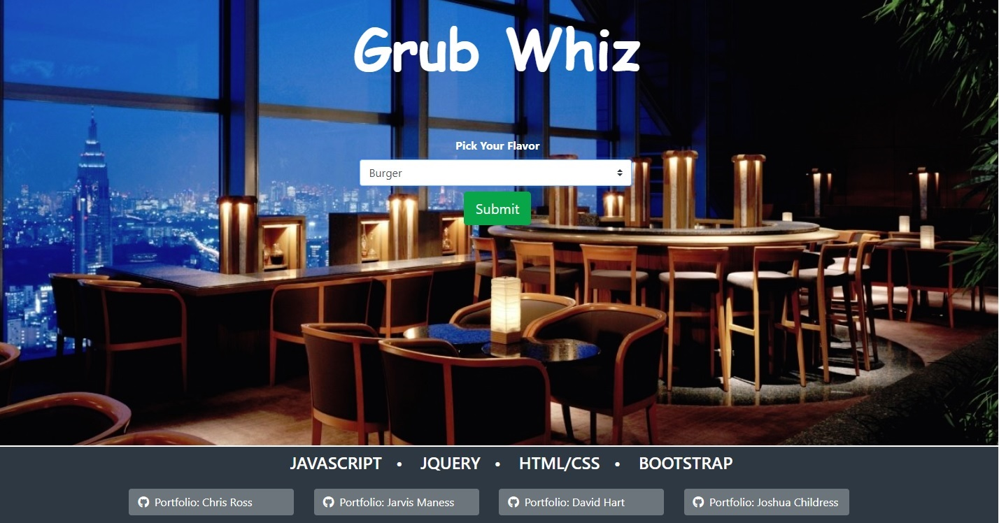
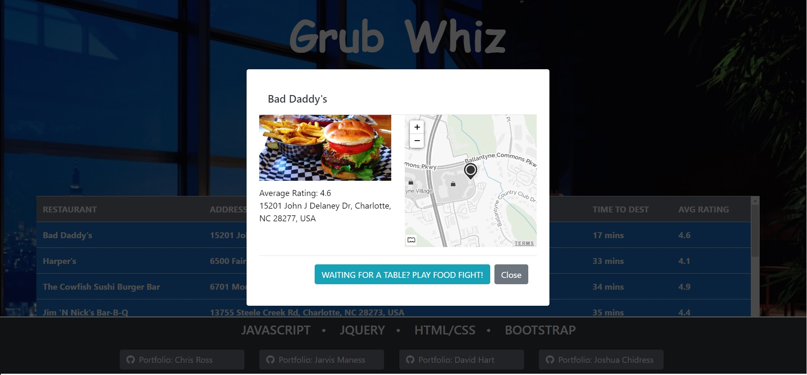

<h1>GRUB WIZ</h1>

<p>Try online at:</p>
https://vilagen.github.io/project1/

<h3>Technology</h3>
<hr>
<ul>
    <li>API</li>
    <li>Javascript</li>
    <li>jQuery</li>
    <li>Bootstrap</li>
    <li>HTML/CSS</li>    
</ul>

<p>With this project, our instructors organized us into teams of students that haven't worked together before. The goal was to learn how to use github as a team; and to use an agile methodology to brainstorm, plan, and execute a web application within two weeks that used at least two APIs.</p>

<p>Our team came up with the idea of an application that would help users find local restaurants near their location. We used APIs from Zomato, and Google, and included maps from Mapquest.</p>




<p>Items we identified for further, future development</p>
<ul>
    <li>Allow users to select non-local cities</li>
    <li>Include phone number (Zomato charges for this)</li>
    <li>Include recent reviews</li>
    <li>Improve sorting by converting distances from text based kilometers, to a number</li>
    <li>Further debugging of Food Fight game</li>
</ul>


<h2>Mission (Homework)</h2> 
# project1

# Student Do: GitHub Issues

* In this activity you will create an Issue on GitHub utilizing the template provided.

## Instructions

* Start by listing the tasks involved in completing each of your user stories.

* Once you have 1-5 tasks written up for each user story, open a GitHub issue for each task by clicking on `Issues` and the green `New Issue` button.

Use the template below, replacing the user stories and acceptance criteria with your own.

```
## User Story
As a user, I want to be able to input search queries so that I can search Stack Overflow when I'm stuck.

## Acceptance Criteria
- [ ] index.html has a text input
- [ ] index.html has a search button
```

* **This is a critical task.** Don't be afraid to ask instructional staff for help during this part. Make sure that each task is clear and everyone on the team understands how to implement each one. 

As an example:

In a dating website application...

**User Story**: As a user I want to see my closest match, so that I can meet someone with whom I share interests.

* **BAD TASK**: 
1. On new member form submit, find and display best match.

* **GOOD TASKS**: 
1. build a form that captures user scores (1-5) to ten questions. 
2. On submit, save the ten numerical answers to as an array.
3. Compare the user array to each existing user array and find the closest match.
4. Display the closest match to the user.
=======
=======
<ol>
    <li>Target audience is hungry people that are looking for a local place to eat based on certain criteria.</li>
    <li>Provide a simple way to get info about local restaurants.</li>
    <li>Provide an intuitive way to search based on criteria such as location, style, cost, menu.</li>
    <li>User wants easy way to lookup local restaurant.</li>
    <li>User wants to specify type of restaurant.</li>
    <li>User wants some user basic review info.</li>
</ol>
  
# Acceptance Criteria
<ol>
    <li>html has input for search criteria such as style, cost, rating, name of restaurant.</li>
    <li>This would be via toggle(s) based on what user wants to search.</li>
    <li>html has serach button.</li>
    <li>html has div outputs for results, pictures, maps.</li>
    <li>Design for mobile layout as priority. </li>
</ol>

